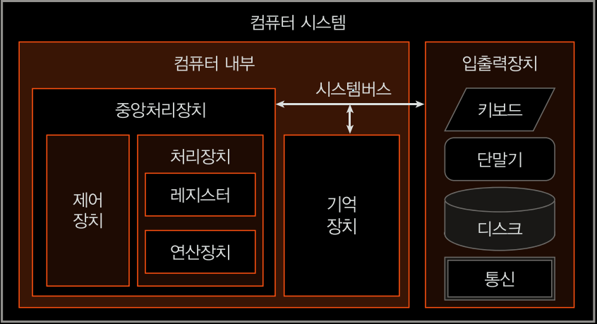

# Chapter1_컴퓨터 구조 소개

1.1 컴퓨터 구조의 범위
---
컴퓨터 : 다량의 수치계산을 바르고 정확하게 수행하는 용도로 개발되었으며, 명령어를 실행하는 기계임.

프로그램 : 명령어들이 의미있는 **순서대로** 나열된 것.

|계층적으로 본 컴퓨터|
|----|
| 고급언어프로그램 |
| 어셈블리프로그램 |
| 명령어 집합 |
| 프로그래머 모델 |
| 컴퓨터조직 |
| 2진수 체계 및 논리회로 |
| 반도체기술 |

위로 갈수록 사용자와 친함.  
반도체기술~프로그래머모델 - 하드웨어
2진수 체계 및 논리회로~명령어집합 - 컴퓨터구조
어셈블리프로그램~고급언어프로그램 - 소프트웨어

반도체 기술은 반도체의 물리적특성을 이용하여 전기적으로 동작하는 스위칭소자를 제공한다. 스위칭 소자는 전기 신호에 의해 신호를 전달하고, 차단하는 기능을 가지고 있다.

대표적인 스위칭 소자는 바로 트랜지스터이며, 컴퓨터의 기본 소자인 논리 게이트를 구현한다.

컴퓨터조직 : 중앙처리장치, 기억장치, 입출력장치 같은 컴퓨터 구성요소들의 세부 사항과 서로 간의 물리적인 연결 상태를 컴퓨터 조직이라고 부름.

프로그램모델 : 컴퓨터 조직 중에서 프로그래머가 프로그램을 작성할 수 있도록 프로그래머에게 제공되는 부분을 뜻함.

명령어 : 컴퓨터가 프로그래머의 동작을 지시받아 실행할 수 잇는 최소의 작업단위. 명령어는 2진수 코드로 정의되어 있다. 

어셈블러 : 어셈블러 언어로 작성된 프로그램을 기계어로 번역한다. (고급언어로 작성된 프로그램은 컴파일러에 의해 어셈블리언어 프로그램으로 번역된다.)

1.2 컴퓨터 구성요소
---
폰 노이만이 제안한 프로그램 내장 구조로 귀결됨. 프로그램 내장 구조란, 데이터를 기억장치 안에 저장하는 것을 의미한다. 

현대의 모든 컴퓨터는 프로그램 내장 구조를 따르고 있다.

프로그램 내장형 컴퓨터 : 프로그램과 데이터를 입력하여 기억장치에 저장하고, 중앙처리장치에서 데이터를 처리하여, 그 결과를 다시 기억장치에 저장하고, 처리결과를 출력한다.

< 컴퓨터 시스템의 구성요소 >

중앙처리장치 : 기억장치에 있는 명령어들을 하나씩 가져와, 명령어의 의미를 해석하고 데이터를 처리함.
>* 제어장치 : 명렁어를 해석하고, 컴퓨터 시스템의 내부의 모든 동작을 제어함.
>* 처리장치 : 데이터를 처리하고, 중앙처리장치 안에 있는 **레지스터**는 연산에 필요한 데이터 및 상태를 저장하는 기억장치.
**연산장치**는 컴퓨터 내부에서 모든 연산을 담당함.

기억장치 : 프로그램과 데이터를 저장하는 기능 수행. 기억장치는 두 가지 형태의 데이터를 저장한다고 말할 수 있는데, 한가지는 중앙처리장치가 처리할 **명령어**이고, 나머지는 **명령어가 처리할 대상인 데이터**다.

입출력장치 : 컴퓨터 내부를 외부로 연결하는 역할. 사용자 또는 컴퓨터 외부에서 프로그램이나 데이터를 컴퓨터에게 공급하고 처리결과를 받아가는 기능을 수행함.

시스템버스 : **중앙처리장치, 기억장치, 입출력장치**는 시스템 버스를 통해 서로 연결되며, 여러개의 선으로 구성되어 있는 **데이터 경로(Data Path)** 다. 주소와 데이터, 제어신호를 전달함.

1.3 컴퓨터의 발달 과정
---
1세대) 1600년대 - 기계식 컴퓨터의 역사 시작.
  > 1900년도에 들어와서 만들어진 기계식 컴퓨터는 미사일 탄도 계산 등에 응용함.
 
2세대) 1946년 - ENIAC 전자식 컴퓨터의 시작. 진공관 사용.
 > 1951년  UNIVAC

3세대) 1959년 - **트렌지스터**를 기본 소자로 한 컴퓨터 개발. 주기억장치는 자기 코어가 사용됨. 집적회로(IC)를 사용하게 되었고, 이 시기에 반도체 주기억장치와 운영체제도 등장함.

4세대) 마이크로 프로세서의 출현. 대규모 집적회로. 

-----

01 프로그램 구조에 대한 설명
* 프로그램과 데이터를 기억장치 안에 저장한다.
* 연산에 필요한 데이터를 레지스터에 저장한다.
* 중앙처리장치는 명령어를 가져와 데이터를 처리한다.

02 컴퓨터의 기본적인 동작을 표현하는 소자
* 논리게이트

03 컴퓨터의 하드웨어와 소프트웨어를 연결하는 요소
* 명령어

04 프로그래머 관점에서 본 컴퓨터 하드웨어를 표현하는 용어
* 프로그래머 모델

05 프로그래머가 컴퓨터에게 동작을 지시하는 최소의 작업 단위?
* 명령어

06 기계 코드?
* 명령어를 2진수로 표현한 것.

07 폰 노이만이 제안한 컴퓨터 구조?
* 프로그램 내장형 컴퓨터

08 중앙처리장치에서 처리장치에 해당하는 것?
* 레지스터, 연산장치

09 제어장치 기능?
* 명령어를 해독하고 제어신호 생성

10 컴퓨터구성요소간에 데이터를 교환하는 전달경로?
* 시스템 버스

11 한 개의 버스 선은 몇 비트의 정보를 전달할 수 있는지?
* 한 비트의 정보를 전달할 수 있다.